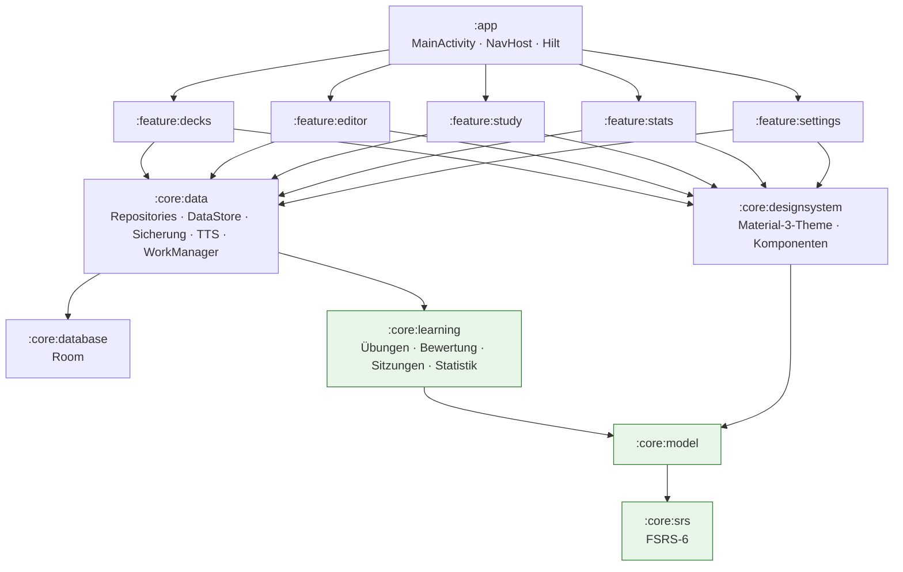

<div align="center">

# Engram

**Wissenschaftlich fundierter Vokabeltrainer für Android: verteilte Wiederholung mit FSRS-6, kombiniert mit adaptiven, automatisch bewerteten Übungen.**

[](https://github.com/AhadPorkar/engram/actions/workflows/ci.yml)


[English](README.md) · Deutsch

</div>

---

Engram hilft dabei, Wörter **einmal** zu lernen und sie **über Jahre** zu behalten. Jedes Wort wird mit
**FSRS-6** geplant, dem Open-Source-Gedächtnismodell, das Anki seit Version 23.10 verwendet. Gelernt wird mit
abwechslungsreichen, selbstkorrigierenden Übungen, wie man sie von Memrise und Babbel kennt. Ein Wort beginnt mit
Wiedererkennen (Multiple Choice), geht dann zu gestütztem Abrufen über (Buchstabenkacheln, Lückentext) und
endet beim freien Abrufen (Tippen, Sprechen), je stabiler die Erinnerung wird.

> *Engramm* ist der Fachbegriff der Neurowissenschaft für die Spur, die eine Erinnerung im Gehirn hinterlässt.
> Das Projekt ist die Neuentwicklung (2026) von **ProjectShaco**, einer kleinen Wortlisten-App, die ich 2019
> geschrieben habe (siehe [Von ProjectShaco zu Engram](#von-projectshaco-2019-zu-engram-2026)).

<!-- Screenshots: docs/screenshots/home.png, study.png und stats.png hinzufügen, dann einkommentieren.
<p align="center">
  
  
  
</p>
-->

## Funktionen

### Lernen
| | |
|---|---|
| **FSRS-6-Planung** | Stabilität, Schwierigkeit und Abrufwahrscheinlichkeit für jede Karte. Reine Kotlin-Implementierung, per Golden-Vector-Test gegen die Referenzimplementierung (`py-fsrs` 6) geprüft. |
| **Gewünschte Behaltensquote** | Wählbar von 75 bis 97 %. Das Intervall wird so berechnet, dass du dich am Tag der Wiederholung mit genau dieser Wahrscheinlichkeit an das Wort erinnerst. |
| **Lern- und Wiederlernschritte** | Kurzfristige Schritte wie bei Anki (1 Min. / 10 Min.), bevor ein Wort in tagesbasierte Intervalle wechselt. |
| **Intervall-Streuung** | Verteilt zusammen gelernte Wörter, damit sie nicht dauerhaft gebündelt wiederkommen. |
| **Persönliche Parameter** | Die in Anki optimierten 21 FSRS-6-Werte (oder 19 FSRS-5-Werte) lassen sich einfügen. |
| **Adaptive Übungsleiter** | 8 Formate, ausgewählt nach der aktuellen Gedächtnisstabilität der Karte (siehe Tabelle unten). |
| **Automatische Bewertung** | Richtigkeit, Tippfehler-Abstand, Tipps und Antwortzeit werden auf Nochmal / Schwer / Gut / Leicht abgebildet. Lernende müssen sich nie selbst bewerten. |
| **Intelligente Antwortprüfung** | Ignoriert Groß-/Kleinschreibung, Satzzeichen und (optional) Akzente. Akzeptiert „strasse“ für „Straße“ und jede Alternative aus „to go; to walk“. Erlaubt Tippfehler abhängig von der Wortlänge. Wertet einen fehlenden oder falschen Artikel (*die* Hund) als „fast richtig“. |
| **Präzises Feedback** | Ein Vergleich auf Buchstabenebene zeigt genau, welche Buchstaben fehlten oder zu viel waren. |
| **Problemwörter (Leeches)** | Achtmal (einstellbar) vergessene Wörter werden markiert oder ausgesetzt und mit dem Tipp aufgelistet, eine Eselsbrücke zu ergänzen. |
| **Rückgängig** | Macht die letzte Antwort rückgängig: Kartenzustand, Wiederholungsprotokoll und Warteschlange der Sitzung. |

#### Die Übungsleiter

| Gedächtnisstabilität | Erkennungskarte (Wort → Bedeutung) | Produktionskarte (Bedeutung → Wort) |
|---|---|---|
| neu | **Einführung**: Wort, Bedeutung, Beispiel, Audio | noch nicht eingeführt (rezeptiv vor produktiv) |
| < 1 Tag | Multiple Choice | Umgekehrtes Multiple Choice |
| 1–4 Tage | Multiple Choice | Buchstabenkacheln · umgekehrtes Multiple Choice |
| 4–14 Tage | Multiple Choice · **Hörverstehen** | Buchstabenkacheln · **Lückentext** · Tippen |
| ≥ 14 Tage | Hörverstehen · Karteikarte | **Tippen** · Lückentext · **Sprechen** |

### Lernmodi
- **Lernen & wiederholen** (adaptive Übungen, automatisch bewertet) – der Standard.
- **Karteikarten** – klassische Karten zum Umdrehen wie bei Anki, mit vier Tasten, die das nächste Intervall anzeigen (z. B. „10 Min. · 2 T. · 5 T. · 2,1 Mon.“).
- **Üben** – Drill ohne Änderung des Plans: *gemischt, älteste zuerst, neueste zuerst, nur markierte Wörter, schwächste zuerst*. Das sind die fünf Modi der ursprünglichen App.

### Wörter & Decks
- Notizen mit **Wort, Bedeutung, Synonymen, Beispielsatz, Eselsbrücke, Tags** und **Markierung**.
- Jede Notiz erzeugt eine Erkennungskarte und optional eine Produktionskarte.
- Tageslimits pro Deck (neue Wörter / Wiederholungen), Duplikatwarnung, „Speichern & weiter“ für schnelle Eingabe.
- Suche und Filter „nur markierte“. Jedes Wort zeigt seine aktuelle Erinnerungswahrscheinlichkeit.
- Zwei Start-Decks: *German A1 · Everyday words* und *English · Academic words*.

### Motivation & Überblick
- Tagesziel-Ring, **Serien (Streaks)** und tägliche **Erinnerung** über WorkManager. Die Erinnerung kommt nur, wenn wirklich etwas ansteht.
- Statistik:
  - tatsächliche Behaltensquote der letzten 30 Tage
  - Wiederholungen pro Tag
  - 30-Tage-Prognose
  - Karten nach Reifegrad
  - **„Wörter, die du jetzt kannst“** (Summe der Abrufwahrscheinlichkeiten)
  - die Wörter kurz vor dem Vergessen und die Problemwörter

### Daten & Plattform
- **JSON-Sicherung und Wiederherstellung** (ersetzen oder zusammenführen) über das Storage Access Framework, ohne Speicherberechtigung. Datenbank und Einstellungen sind zusätzlich Teil von Android Auto Backup.
- **Import** von CSV-, TSV- und Anki-„Notizen als Klartext“-Dateien. Kopfzeilen werden erkannt, Felder in Anführungszeichen werden unterstützt.
- **Import alter ProjectShaco-Sicherungen** (die SQLite-Datei `word_database`).
- Aussprache per Text-to-Speech (normal und langsam) und Spracherkennung auf dem Gerät.
- **Englische und deutsche Oberfläche** mit App-Sprache pro App (Android 13+), RTL-fähige Layouts, helles und dunkles Design, optional Material-You-Farben und Inhaltsbeschreibungen für TalkBack.

## Die Lernwissenschaft in einer Tabelle

| Prinzip | Umsetzung in Engram |
|---|---|
| Spacing-Effekt (Ebbinghaus; Cepeda et al., 2006) | FSRS-6 plant jede Wiederholung kurz vor dem vorhergesagten Vergessen |
| Testeffekt / Abrufübung (Roediger & Karpicke, 2006) | Jede Übung verlangt Abrufen statt erneutem Lesen |
| Erwünschte Erschwernisse (Bjork, 1994) | Die Übungsleiter hält das Abrufen anstrengend, aber erfolgreich |
| Generierungseffekt (Slamecka & Graf, 1978) | Tippen, Lückentext und Sprechen: Du erzeugst das Wort selbst |
| Rezeptiver → produktiver Wortschatz (Nation, 2001) | Produktionskarten starten erst, wenn die Erkennungskarte nicht mehr neu ist |
| Verschachteltes Üben (Kornell & Bjork, 2008) | Neue Wörter werden unter Wiederholungen gemischt, Decks reihum kombiniert |
| Feedback (Hattie & Timperley, 2007) | Sofortiges, fehlerspezifisches Feedback mit Vergleich auf Buchstabenebene |
| Duale Kodierung (Paivio) | Jedes Wort wird gesehen *und* gehört (TTS, Hörübungen) |
| Elaboratives Enkodieren | Eselsbrücken und Beispielsätze; bei Problemwörtern wird dazu angeregt |

Die ausführliche Erklärung mit den FSRS-6-Formeln steht in **[docs/learning-science.de.md](docs/learning-science.de.md)**.

## Architektur

Mehrmodulig, mit unidirektionalem Datenfluss (MVVM + Repository), nach dem
[offiziellen Android-Architekturleitfaden](https://developer.android.com/topic/architecture) und der Struktur von *Now in Android*.



Die grünen Module sind **reines Kotlin/JVM ohne Android-Abhängigkeit**. Die gesamte Lern-Engine
(Planer, Übungsauswahl, Antwortprüfung, Zustandsautomat der Sitzung, Statistik) lässt sich daher in
Millisekunden testen und wiederverwenden, zum Beispiel in einem Kotlin-Multiplatform-Client.

| Bereich | Technologie |
|---|---|
| Sprache | Kotlin 2.1, Coroutines & Flow |
| UI | Jetpack Compose, Material 3, typsichere Navigation Compose |
| DI | Hilt (KSP) |
| Persistenz | Room (mit Schema-Export) für Decks / Notizen / Karten / Wiederholungsprotokolle; DataStore für Einstellungen |
| Hintergrundarbeit | WorkManager (tägliche Erinnerung) |
| Serialisierung | kotlinx.serialization (Sicherungsformat, Navigationsrouten) |
| Audio | Android TextToSpeech, RecognizerIntent |
| Tests | JUnit 4, Robolectric (Room in-memory), kotlinx-coroutines-test, Turbine |
| Build | Gradle Kotlin DSL, Version Catalog, GitHub Actions, Dependabot |

### Projektstruktur
```
app/                    Application, MainActivity, Navigationsgraph, Manifest, Launcher-Icon
core/srs/               FSRS-6: Rating, SchedulingState, FsrsAlgorithm, FsrsScheduler (+ Golden-Test)
core/model/             Deck, Note, Card, ReviewLog, UserSettings, StudyMode …
core/learning/          answer/   – Normalisierung, Damerau-Levenshtein, Diff, Bewertung der Antwort
                        exercise/ – Auswahl (Leiter), Fabrik, Distraktoren, Lückentext, Buchstabenkacheln
                        grading/  – RatingPolicy (Übungsergebnis → FSRS-Bewertung)
                        session/  – SessionPlanner, StudySession (Warteschlange, Lernschritte, Undo), StudyDayClock
                        stats/    – StatsCalculator (Behaltensquote, Serien, Prognose, bekannte Wörter)
core/database/          Room-Entitäten, DAOs, EngramDatabase, schemas/
core/data/              Repositories, DataStore-Einstellungen, Sicherung & Import, TTS, Erinnerungen, Start-Decks
core/designsystem/      Theme (hell/dunkel/dynamisch), Komponenten, Formatierer
feature/decks|editor|study|stats|settings/   Compose-Screens + ViewModels + Navigation
docs/                   Lernwissenschaft (EN/DE), Architekturentscheidungen (ADR)
```

## Von ProjectShaco (2019) zu Engram (2026)

Die ursprüngliche App (`com.apr.projectshaco`) hatte eine einzige Worttabelle, einen ViewPager mit
Karteikarten und eine Datenbankkopie nach `/Downloads`. Die Menüpunkte „Spaced repetition“, „Saved word“ und
„Import DataBase“ waren nie umgesetzt. Engram behält die Idee bei, setzt alle geplanten Funktionen um und
ersetzt jede Schicht:

| ProjectShaco (2019) | Engram (2026) |
|---|---|
| Paket `com.apr.projectshaco` | `com.ahadporkar.engram` (+ `.core.*`, `.feature.*`) |
| `Word(word, meaning, synonyms)` | `core.model.Note` (+ Beispiel, Eselsbrücke, Tags, Markierung) → 1–2 `Card`s |
| `WordRoomDatabase` (Room 1.1, `fallbackToDestructiveMigration`) | `core.database.EngramDatabase` (Room 2.7, 4 Tabellen, exportiertes Schema) |
| `WordDao`, `WordRepository`, `WordViewModel`, `MyViewModelFactory` | DAOs + Repository-Interfaces, per Hilt injizierte `@HiltViewModel`s, UI-State als `StateFlow` |
| `MainActivity` + `WordListAdapter` (RecyclerView) | `feature.decks` – `DecksScreen`, `DeckDetailScreen` (Compose `LazyColumn`) |
| `word_input_dialog.xml` | `feature.editor.NoteEditorScreen` |
| `FLashCardSettingActivity` (5 Radiobuttons) | Lernmodi + Übungsreihenfolgen (`StudyMode`, `CramOrder`) |
| `FlashCardActivity`, `MyFragment`, `MyFragmentPagerAdapter` | `feature.study` – `StudyScreen` mit 8 Übungstypen |
| „Spaced repetition“ (nicht umgesetzt) | `core.srs.FsrsScheduler` (FSRS-6) |
| „Saved word“ (nicht umgesetzt) | markierte Notizen + Übungsmodus „Nur markierte Wörter“ |
| `DBUtil.SaveDB()` (rohe Dateikopie, Speicherberechtigung, `System.exit`) | `core.data.backup.BackupRepository` (versioniertes JSON, SAF, Ersetzen/Zusammenführen) |
| „Import DataBase“ (leer) | CSV-/TSV-/Anki-Import + **Import der alten Datei `word_database`** |
| Android Support Library 28, Kotlin 1.3, Synthetics | AndroidX, Kotlin 2.1, Compose, Hilt, KSP |

## Bauen & starten

Voraussetzungen: **Android Studio Narwhal (2025.1) oder neuer**, JDK 17+, Android SDK 36.

```bash
git clone https://github.com/AhadPorkar/engram.git
cd engram
./gradlew :app:installDebug          # bauen und auf Gerät/Emulator installieren
```

Der Debug-Build nutzt die Application-ID `com.ahadporkar.engram.debug` und lässt sich neben einem Release-Build installieren.
Beim ersten Start werden die zwei Start-Decks angelegt. Den Import aus der alten App probierst du unter
*Einstellungen → ProjectShaco-Sicherung importieren* mit einer `word_database`-Datei aus.

## Tests

```bash
./gradlew :core:srs:test :core:learning:test   # Lern-Engine – reines JVM, läuft in Sekunden
./gradlew testDebugUnitTest                    # + Robolectric (Room, Repositories) und ViewModel-Tests
./gradlew :app:lintDebug                       # Android Lint für alle Module
```

| Test-Suite | Was sie belegt |
|---|---|
| `FsrsSchedulerTest` | reproduziert die offizielle `py-fsrs`-6-Intervallfolge `0, 2, 11, 46, 163, 498, 0, 0, 2, 4, 7, 12, 21`; Lernschritte, Vergessen, Grenzen der Streuung, maximales Intervall |
| `FsrsAlgorithmTest` | Vergessenskurve und Intervall sind invers; R = 90 % bei t = S; Grenzen von D und S; Parameter-Parsing |
| `AnswerEvaluatorTest`, `AnswerDiffTest` | Akzente, Artikel, Alternativen, Synonyme, Tippfehler-Toleranz, persischer Text, Diff |
| `ExerciseTest` | die Leiter, Qualität der Distraktoren, Lückentext-Erkennung, Buchstabenkacheln, Rückfallformate |
| `SessionPlannerTest`, `StudySessionTest` | Limits, Geschwisterkarten, Erkennung vor Produktion, Verschachtelung, Lernschritte innerhalb der Sitzung, Wiederholung im Übungsmodus, Problemwörter, Undo |
| `StatsCalculatorTest` | Serien, tatsächliche Behaltensquote, Prognose, Reifegrad, Grenze des Lerntags |
| `EngramDatabaseTest`, `RepositoryIntegrationTest` | SQL-Zählungen, Suche, Kaskaden, Tageslimits, Speichern und Rückgängigmachen von Antworten, Sicherung hin und zurück |
| `DelimitedTextParserTest` | Anki-Exporte, Kopfzeilen, RFC-4180-Anführungszeichen, BOM |
| `StudyViewModelTest` | Einführung → Multiple Choice → gespeicherte Wiederholung; falsche Antwort → Undo |

Insgesamt **92 Tests**. Die CI führt sie bei jedem Push aus, zusammen mit Lint und einem Debug-APK-Build (als Artefakt herunterladbar).

## Roadmap
- FSRS-Parameter direkt auf dem Gerät aus den gespeicherten Wiederholungen optimieren
- Startbildschirm-Widget (Glance) mit dem Tagesziel
- Bilder und eigene Audioaufnahmen an Notizen; geteilte Decks
- Compose-Screenshot-Tests und Baseline Profiles
- Gradle-Convention-Plugins für die Modul-Buildskripte

## Lizenz
[MIT](LICENSE) © 2019–2026 Ahad Porkar.
FSRS wurde von der Community [open-spaced-repetition](https://github.com/open-spaced-repetition) entwickelt; dieses Projekt enthält eine unabhängige Kotlin-Implementierung der veröffentlichten Formeln.
