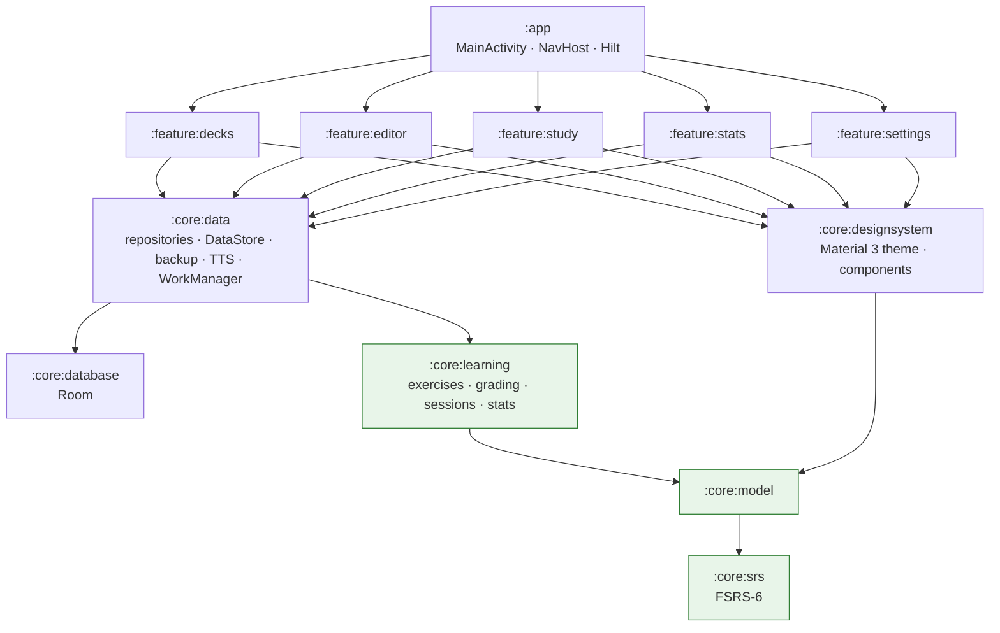

<div align="center">

# Engram

**A science-based vocabulary trainer for Android: FSRS-6 spaced repetition combined with adaptive, auto-graded exercises.**

[](https://github.com/AhadPorkar/engram/actions/workflows/ci.yml)


English · [Deutsch](README.de.md)

</div>

---

Engram helps you learn words **once** and keep them **for years**. It schedules every word with
**FSRS-6**, the open-source memory model that Anki uses since version 23.10, and teaches with the kind of
varied, self-correcting exercises known from Memrise and Babbel. A word starts with recognition
(multiple choice), moves on to cued recall (letter tiles, fill-in-the-gap) and ends with free recall
(typing, speaking) as its memory becomes more stable.

> *Engram* is the neuroscience term for the physical trace a memory leaves in the brain.
> The project is the 2026 rewrite of **ProjectShaco**, a small word-list app I wrote in 2019
> (see [From ProjectShaco to Engram](#from-projectshaco-2019-to-engram-2026)).

<!-- Screenshots: add docs/screenshots/home.png, study.png and stats.png, then uncomment.
<p align="center">
  
  
  
</p>
-->

## Features

### Learning
| | |
|---|---|
| **FSRS-6 scheduling** | Stability, difficulty and retrievability for every card. Pure-Kotlin implementation, verified against the reference implementation (`py-fsrs` 6) with a golden-vector test. |
| **Desired retention** | Choose 75–97 %. The interval is computed so you still recall the word with exactly that probability on the day it comes back. |
| **Learning & relearning steps** | Anki-style short-term steps (1 min / 10 min) before a word graduates to day-based intervals. |
| **Interval fuzz** | Spreads words that were learned together so they do not stay in clumps. |
| **Personal parameters** | Paste the 21 FSRS-6 (or 19 FSRS-5) weights you optimised in Anki. |
| **Adaptive exercise ladder** | 8 formats chosen from the card's current memory stability (see table below). |
| **Auto-grading** | Answer correctness, typo distance, hints and response time are mapped to Again / Hard / Good / Easy, so learners never have to grade themselves. |
| **Smart answer checking** | Ignores case, punctuation and (optionally) accents. Accepts “strasse” for “Straße” and any alternative in “to go; to walk”. Allows typos depending on word length. Treats a missing or wrong German article (*die* Hund) as “almost”. |
| **Precise feedback** | A character-level diff shows exactly which letters were missing or extra. |
| **Leech detection** | Words forgotten 8 times (configurable) are flagged or suspended and listed with a tip to add a memory hook. |
| **Undo** | Reverts the last answer: card state, review log and session queue. |

#### The exercise ladder

| Memory stability | Recognition card (word → meaning) | Production card (meaning → word) |
|---|---|---|
| new | **Presentation**: word, meaning, example, audio | not yet introduced (receptive before productive) |
| < 1 day | Multiple choice | Reverse multiple choice |
| 1–4 days | Multiple choice | Letter tiles · reverse multiple choice |
| 4–14 days | Multiple choice · **Listening** | Letter tiles · **Cloze** · Typing |
| ≥ 14 days | Listening · Flashcard | **Typing** · Cloze · **Speaking** |

### Study modes
- **Learn & review** (adaptive exercises, auto-graded) – the default.
- **Flashcards** – classic Anki-style flip cards with four buttons that show the next interval (e.g. “10m · 2d · 5d · 2.1mo”).
- **Practice** – drills without changing the schedule: *shuffled, oldest first, newest first, starred words only, weakest first*. These are the five modes of the original app.

### Words & decks
- Notes with **word, meaning, synonyms, example sentence, memory hook, tags** and a **star**.
- Each note produces a recognition card and, optionally, a production card.
- Daily limits per deck (new words / reviews), duplicate warning, “save & next” for fast entry.
- Search and starred-only filter. Each word shows its current recall probability.
- Two starter decks: *German A1 · Everyday words* and *English · Academic words*.

### Motivation & insight
- Daily goal ring, **streaks**, and a daily **reminder** via WorkManager. The reminder is sent only if there is something to do.
- Statistics:
  - true retention over the last 30 days
  - reviews per day
  - 30-day forecast
  - cards by maturity
  - **“words you know right now”** (the sum of retrievabilities)
  - the words closest to being forgotten, and leeches

### Data & platform
- **JSON backup / restore** (replace or merge) through the Storage Access Framework, with no storage permission needed. The database and settings are also included in Android Auto Backup.
- **Import** of CSV / TSV / Anki “Notes in Plain Text” files. Headers are detected and quoted fields are supported.
- **Import of old ProjectShaco backups** (the `word_database` SQLite file).
- Text-to-speech pronunciation (normal and slow) and on-device speech recognition.
- **English and German UI** with per-app language support (Android 13+), RTL-ready layouts, light and dark themes, optional Material You dynamic colour, and content descriptions for TalkBack.

## The learning science in one table

| Principle | Where it is in Engram |
|---|---|
| Spacing effect (Ebbinghaus; Cepeda et al., 2006) | FSRS-6 schedules each review just before the predicted forgetting point |
| Testing effect / retrieval practice (Roediger & Karpicke, 2006) | Every exercise asks you to retrieve, not to re-read |
| Desirable difficulties (Bjork, 1994) | The exercise ladder keeps retrieval effortful but still successful |
| Generation effect (Slamecka & Graf, 1978) | Typing, cloze and speaking: you produce the word yourself |
| Receptive → productive vocabulary (Nation, 2001) | Production cards start only after the recognition card is no longer new |
| Interleaving (Kornell & Bjork, 2008) | New words are mixed into reviews, and decks are mixed round-robin |
| Feedback (Hattie & Timperley, 2007) | Immediate, error-specific feedback with a letter-level diff |
| Dual coding (Paivio) | Every word is seen *and* heard (TTS, listening exercises) |
| Elaborative encoding | Memory hooks and example sentences; leeches prompt you to add one |

The full explanation, including the FSRS-6 formulas, is in **[docs/learning-science.md](docs/learning-science.md)**.

## Architecture

Multi-module, unidirectional data flow (MVVM + repository), following the
[official Android architecture guidance](https://developer.android.com/topic/architecture) and the structure of *Now in Android*.



The green modules are **plain Kotlin/JVM with no Android dependency**. The whole learning engine
(scheduler, exercise selection, answer checking, session state machine, statistics) can therefore be
unit-tested in milliseconds and reused, for example, in a Kotlin Multiplatform client.

| Concern | Technology |
|---|---|
| Language | Kotlin 2.1, coroutines & Flow |
| UI | Jetpack Compose, Material 3, type-safe Navigation Compose |
| DI | Hilt (KSP) |
| Persistence | Room (schema export) for decks / notes / cards / review logs; DataStore for settings |
| Background work | WorkManager (daily reminder) |
| Serialization | kotlinx.serialization (backup format, navigation routes) |
| Audio | Android TextToSpeech, RecognizerIntent |
| Testing | JUnit 4, Robolectric (Room in-memory), kotlinx-coroutines-test, Turbine |
| Build | Gradle Kotlin DSL, version catalog, GitHub Actions, Dependabot |

### Project layout
```
app/                    Application, MainActivity, navigation graph, manifest, launcher icon
core/srs/               FSRS-6: Rating, SchedulingState, FsrsAlgorithm, FsrsScheduler (+ golden test)
core/model/             Deck, Note, Card, ReviewLog, UserSettings, StudyMode …
core/learning/          answer/   – normalisation, Damerau–Levenshtein, diff, evaluator
                        exercise/ – selector (ladder), factory, distractors, cloze, letter tiles
                        grading/  – RatingPolicy (exercise outcome → FSRS rating)
                        session/  – SessionPlanner, StudySession (queue, learning steps, undo), StudyDayClock
                        stats/    – StatsCalculator (retention, streaks, forecast, known words)
core/database/          Room entities, DAOs, EngramDatabase, schemas/
core/data/              repositories, DataStore settings, backup & import, TTS, reminders, seeding
core/designsystem/      theme (light/dark/dynamic), components, formatters
feature/decks|editor|study|stats|settings/   Compose screens + ViewModels + navigation
docs/                   learning science (EN/DE), architecture decision records
```

## From ProjectShaco (2019) to Engram (2026)

The original app (`com.apr.projectshaco`) had a single word table, a ViewPager of flashcards and a
database copy to `/Downloads`. Its “Spaced repetition”, “Saved word” and “Import database” menu
entries were never implemented. Engram keeps the idea, implements every feature that was planned,
and replaces every layer:

| ProjectShaco (2019) | Engram (2026) |
|---|---|
| package `com.apr.projectshaco` | `com.ahadporkar.engram` (+ `.core.*`, `.feature.*`) |
| `Word(word, meaning, synonyms)` | `core.model.Note` (+ example, memory hook, tags, star) → 1–2 `Card`s |
| `WordRoomDatabase` (Room 1.1, `fallbackToDestructiveMigration`) | `core.database.EngramDatabase` (Room 2.7, 4 tables, exported schema) |
| `WordDao`, `WordRepository`, `WordViewModel`, `MyViewModelFactory` | DAOs + repository interfaces, Hilt-injected `@HiltViewModel`s, `StateFlow` UI state |
| `MainActivity` + `WordListAdapter` (RecyclerView) | `feature.decks` – `DecksScreen`, `DeckDetailScreen` (Compose `LazyColumn`) |
| `word_input_dialog.xml` | `feature.editor.NoteEditorScreen` |
| `FLashCardSettingActivity` (5 radio buttons) | Study modes + practice orders (`StudyMode`, `CramOrder`) |
| `FlashCardActivity`, `MyFragment`, `MyFragmentPagerAdapter` | `feature.study` – `StudyScreen` with 8 exercise types |
| “Spaced repetition” (not implemented) | `core.srs.FsrsScheduler` (FSRS-6) |
| “Saved word” (not implemented) | starred notes + “Starred words only” practice |
| `DBUtil.SaveDB()` (raw file copy, storage permission, `System.exit`) | `core.data.backup.BackupRepository` (versioned JSON, SAF, restore/merge) |
| “Import DataBase” (empty) | CSV/TSV/Anki import + **import of the old `word_database` file** |
| Android Support Library 28, Kotlin 1.3, synthetics | AndroidX, Kotlin 2.1, Compose, Hilt, KSP |

## Build & run

Requirements: **Android Studio Narwhal (2025.1) or newer**, JDK 17+, Android SDK 36.

```bash
git clone https://github.com/AhadPorkar/engram.git
cd engram
./gradlew :app:installDebug          # build and install on a device/emulator
```

The debug build uses the application id `com.ahadporkar.engram.debug`, so it can be installed next to a release build.
On first launch the two starter decks are added. To try the old-app import, use
*Settings → Import ProjectShaco backup* with a `word_database` file.

## Tests

```bash
./gradlew :core:srs:test :core:learning:test   # learning engine – pure JVM, runs in seconds
./gradlew testDebugUnitTest                    # + Robolectric (Room, repositories) and ViewModel tests
./gradlew :app:lintDebug                       # Android lint for all modules
```

| Suite | What it proves |
|---|---|
| `FsrsSchedulerTest` | reproduces the official `py-fsrs` 6 interval sequence `0, 2, 11, 46, 163, 498, 0, 0, 2, 4, 7, 12, 21`; learning steps, lapses, fuzz bounds, max interval |
| `FsrsAlgorithmTest` | forgetting curve and interval are inverse; R = 90 % at t = S; bounds of D and S; parameter parsing |
| `AnswerEvaluatorTest`, `AnswerDiffTest` | accents, articles, alternatives, synonyms, typo tolerance, Persian text, diff |
| `ExerciseTest` | the ladder, distractor quality, cloze extraction, letter tiles, fallbacks |
| `SessionPlannerTest`, `StudySessionTest` | limits, sibling burying, recognition before production, interleaving, learning steps within a session, cram retries, leeches, undo |
| `StatsCalculatorTest` | streaks, true retention, forecast, maturity, study-day boundary |
| `EngramDatabaseTest`, `RepositoryIntegrationTest` | SQL counts, search, cascades, daily limits, persisting and undoing answers, backup round-trip |
| `DelimitedTextParserTest` | Anki exports, headers, RFC 4180 quoting, BOM |
| `StudyViewModelTest` | presentation → multiple choice → persisted review; wrong answer → undo |

**92 tests** in total. CI runs them all on every push, together with lint and a debug APK build (downloadable as an artifact).

## Roadmap
- On-device FSRS parameter optimisation from the stored review logs
- Home-screen widget (Glance) with the daily goal
- Images and recorded audio on notes; shared decks
- Compose UI screenshot tests and baseline profiles
- Gradle convention plugins for the module build scripts

## License
[MIT](LICENSE) © 2019–2026 Ahad Porkar.
FSRS was developed by the [open-spaced-repetition](https://github.com/open-spaced-repetition) community; this project contains an independent Kotlin implementation of its published formulas.
